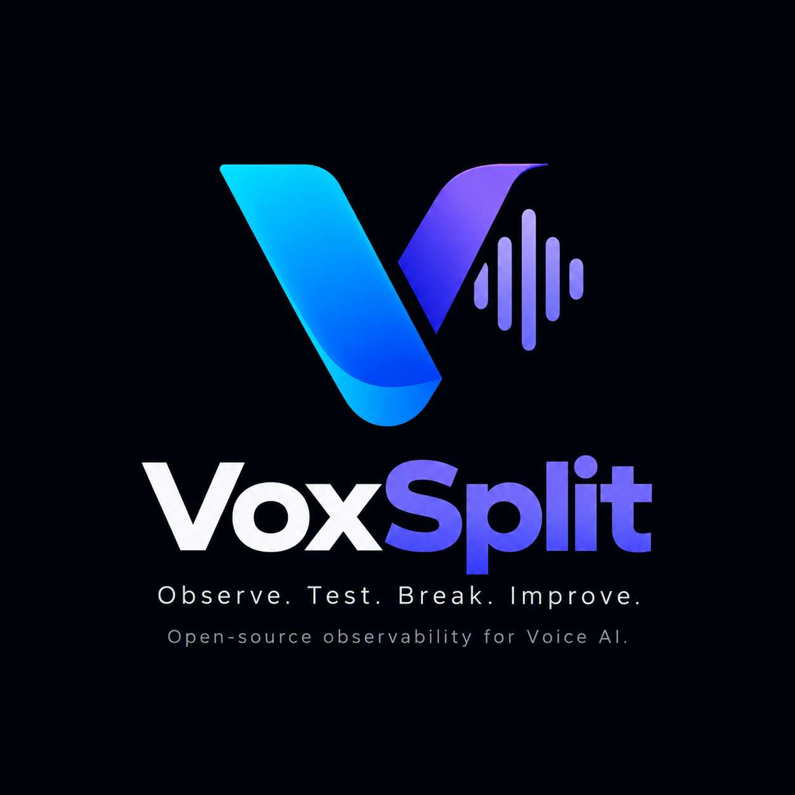

# Voxsplint

Voxsplint is an SDK and testing platform for AI voice agents. It sends adversarial test personas (angry, silent, confused, price-fishing callers) through your agent, scores every stage of the pipeline (STT, LLM, TTS), and reports exactly where and why it breaks — before a real customer finds out.

---

## 📄 License

This project is licensed under the [Apache 2.0 License](LICENSE).
